# VeriRoute Field Services – Logical ERD

> **Source:** Reverse-engineered from screenshots of the VeriRoute test environment (`https://veriroute.org`):
> the **Dashboard** and the **Orders** page. The site itself was not reachable from the build environment.
> **Network**, **Pitches** and **Payments** are modelled on standard signing-agent / field-services workflows
> (agreed guesses) – see §6 for what to validate.

### Key finding from the Orders page

The signed-in account is a plain **User** (`habib / User`) that *also* has a **Professional Account**, and that same
user sees **Create Order**. So VeriRoute is two-sided per user: a user can **dispatch** closings (acting as the
signing service / hiring party) *and* **perform** closings as a professional. The model therefore hangs orders off
`USER_ACCOUNT` (dispatcher) with an optional `COMPANY` (end client), and keeps `PROFESSIONAL` as an optional 1:1 profile.

### Files

- `veriroute-erd.vsdx` – editable **Visio** diagram (grouped entity tables, glued connectors, entity comments as Shape Data)
- `veriroute-erd.svg` – rendered Mermaid diagram
- Regenerate the Visio file after editing the Mermaid block: `python3 tools/mermaid_erd_to_vsdx.py docs/veriroute-erd.md docs/veriroute-erd.vsdx` (needs Graphviz `dot`)

## 1. What the screens tell us

### Dashboard

| UI element | Implied entity / query |
|---|---|
| Banner "10 agreements require acceptance – some features may be restricted" | `AGREEMENT` + `AGREEMENT_ACCEPTANCE`; feature gating when mandatory agreements are unaccepted |
| KPI **New Offers** / panel "New Assignment Offers" | `ASSIGNMENT_OFFER` where `status = Offered` for the current professional |
| "We match you… based on your service area, credentials, and availability" | `SERVICE_AREA`, `CREDENTIAL`, `AVAILABILITY` drive offer matching |
| KPI **Today's Appts** / panel "Today's Assignments" ("closings") | `APPOINTMENT` where `scheduled_start` is today |
| KPI **Docs Waiting** | `DOCUMENT` where `status = Awaiting` (package not yet downloaded/printed) |
| KPI **Scanbacks** | `SCANBACK` where `status = Required/Pending` |
| KPI **Shipments Due** | `SHIPMENT` where `status = Pending` and `due_date <= today` |
| "Earnings & performance metrics are a Verified Pro feature. View plans." | `MEMBERSHIP_PLAN` + `SUBSCRIPTION`; `PAYMENT` + `PERFORMANCE_REVIEW` roll-ups |
| Search "orders, professionals, payments" | Global search across `ORDER`, `PROFESSIONAL`, `PAYMENT` |
| Bell icon | `NOTIFICATION` |

### Orders page

| UI element | Implied entity / field |
|---|---|
| "Manage closings from dispatch through completion" + **Create Order** | `ORDER` created by `USER_ACCOUNT` (`dispatcher_user_id`) |
| Search "order number, signer, or loan type" | `ORDER.order_number`, `ORDER_SIGNER.full_name`, `ORDER.loan_type` |
| Tabs **Unassigned / Offered / In Progress / Scanbacks / Shipping / Closed / Cancelled** | `ORDER.status` values |
| Tabs **Upcoming / Today** | Derived from `APPOINTMENT.scheduled_start` (future / today) |
| Tab **Needs Attention** | Derived flag – see §3 rule 6 (`ORDER.needs_attention`, `attention_reason`) |
| List / grid toggle | UI only (no data impact) |
| Avatar menu: `habib` · **User** · Professional Account · Sign Out | `USER_ACCOUNT.role = User`; `PROFESSIONAL` is an optional profile of the user |

### Guessed pages (not seen)

| Page | Assumed purpose | Entities |
|---|---|---|
| **Network** | Dispatcher's roster of trusted professionals: invite, favourite, group, block | `NETWORK_CONNECTION`, `NETWORK_GROUP`, `NETWORK_GROUP_MEMBER` |
| **Pitches** | Professionals pitch themselves on open/unassigned orders (bid with fee + ETA) or pitch services to a dispatcher/company | `PITCH` (optional `order_id`) |
| **Payments** | Two-sided ledger: *receivables* (client → dispatcher) and *payables / payouts* (dispatcher → professional), with fee breakdown and year-end tax info | `FEE_LINE`, `INVOICE`, `PAYMENT`, `PAYOUT_METHOD`, `TAX_PROFILE` |

## 2. Entity-Relationship Diagram

```mermaid
erDiagram
    %% ---------- Identity & parties ----------
    USER_ACCOUNT ||--o| PROFESSIONAL : "has profile"
    USER_ACCOUNT }o--o| COMPANY : "works for"
    USER_ACCOUNT ||--o{ ORDER : "dispatches"
    COMPANY |o--o{ ORDER : "is client of"

    PROFESSIONAL ||--o{ SERVICE_AREA : "covers"
    PROFESSIONAL ||--o{ CREDENTIAL : "holds"
    PROFESSIONAL ||--o{ AVAILABILITY : "publishes"
    CREDENTIAL_TYPE ||--o{ CREDENTIAL : "classifies"

    %% ---------- Network & pitches (guessed) ----------
    USER_ACCOUNT ||--o{ NETWORK_CONNECTION : "owns roster"
    PROFESSIONAL ||--o{ NETWORK_CONNECTION : "listed in"
    USER_ACCOUNT ||--o{ NETWORK_GROUP : "organises"
    NETWORK_GROUP ||--o{ NETWORK_GROUP_MEMBER : "contains"
    NETWORK_CONNECTION ||--o{ NETWORK_GROUP_MEMBER : "grouped as"
    PROFESSIONAL ||--o{ PITCH : "sends"
    USER_ACCOUNT ||--o{ PITCH : "receives"
    ORDER |o--o{ PITCH : "bid on"
    PITCH |o--o| ASSIGNMENT_OFFER : "converted to"

    %% ---------- Order lifecycle ----------
    ORDER ||--|{ ORDER_SIGNER : "has"
    ORDER ||--o{ ASSIGNMENT_OFFER : "offered via"
    PROFESSIONAL ||--o{ ASSIGNMENT_OFFER : "receives"
    ORDER ||--o| ASSIGNMENT : "results in"
    PROFESSIONAL ||--o{ ASSIGNMENT : "performs"
    ASSIGNMENT_OFFER |o--o| ASSIGNMENT : "accepted as"
    ASSIGNMENT ||--o{ APPOINTMENT : "scheduled as"
    ORDER ||--o{ DOCUMENT : "contains"
    ASSIGNMENT ||--o{ SCANBACK : "requires"
    DOCUMENT ||--o{ SCANBACK : "scanned as"
    ASSIGNMENT ||--o{ SHIPMENT : "returns via"
    SHIPMENT }o--o{ DOCUMENT : "carries"
    ORDER ||--o{ ORDER_STATUS_HISTORY : "tracks"
    ASSIGNMENT ||--o| PERFORMANCE_REVIEW : "rated by"

    %% ---------- Money (guessed) ----------
    ORDER ||--o{ FEE_LINE : "priced by"
    ORDER ||--o{ INVOICE : "billed by"
    INVOICE ||--|{ FEE_LINE : "itemises"
    INVOICE ||--o{ PAYMENT : "settled by"
    USER_ACCOUNT ||--o{ PAYOUT_METHOD : "registers"
    USER_ACCOUNT ||--o| TAX_PROFILE : "files"
    PAYMENT }o--o| PAYOUT_METHOD : "paid to"

    %% ---------- Membership & compliance ----------
    MEMBERSHIP_PLAN ||--o{ SUBSCRIPTION : "subscribed as"
    PROFESSIONAL ||--o{ SUBSCRIPTION : "holds"
    MEMBERSHIP_PLAN ||--o{ PLAN_FEATURE : "unlocks"
    AGREEMENT ||--o{ AGREEMENT_VERSION : "versioned as"
    AGREEMENT_VERSION ||--o{ AGREEMENT_ACCEPTANCE : "accepted in"
    USER_ACCOUNT ||--o{ AGREEMENT_ACCEPTANCE : "gives"

    %% ---------- Communication ----------
    MESSAGE_THREAD ||--|{ MESSAGE : "contains"
    MESSAGE_THREAD }o--o| ORDER : "about"
    MESSAGE_THREAD ||--|{ THREAD_PARTICIPANT : "includes"
    USER_ACCOUNT ||--o{ THREAD_PARTICIPANT : "is"
    USER_ACCOUNT ||--o{ NOTIFICATION : "receives"

    USER_ACCOUNT {
        uuid user_id PK
        string email UK
        string display_name
        enum role "User|CompanyAdmin|PlatformAdmin"
        uuid company_id FK "nullable"
        bool can_dispatch "Create Order"
        bool is_active
        datetime last_login_at
    }
    COMPANY {
        uuid company_id PK
        string name
        enum company_type "Title|Escrow|Lender|SigningService|FieldServices"
        string phone
        string address
        enum status "Active|Suspended"
    }
    PROFESSIONAL {
        uuid professional_id PK
        uuid user_id FK
        string first_name
        string last_name
        string phone
        string home_address
        decimal home_lat
        decimal home_lng
        enum verification_status "Unverified|Pending|Verified"
        decimal avg_rating
        int completed_count
        bool accepting_offers
    }
    SERVICE_AREA {
        uuid service_area_id PK
        uuid professional_id FK
        enum area_type "Radius|County|ZipList"
        string state
        string county
        string zip_code
        int radius_miles
        decimal base_fee
    }
    CREDENTIAL_TYPE {
        uuid credential_type_id PK
        string name "NotaryCommission|E&O|BackgroundCheck|NNA_Cert|Bond"
        bool expires
    }
    CREDENTIAL {
        uuid credential_id PK
        uuid professional_id FK
        uuid credential_type_id FK
        string number
        string issuing_state
        date issued_on
        date expires_on
        decimal coverage_amount
        enum status "Pending|Approved|Rejected|Expired"
        string file_url
    }
    AVAILABILITY {
        uuid availability_id PK
        uuid professional_id FK
        enum day_of_week
        time start_time
        time end_time
        date blackout_date "nullable"
    }
    NETWORK_CONNECTION {
        uuid connection_id PK
        uuid owner_user_id FK "dispatcher"
        uuid professional_id FK "nullable until invite accepted"
        string invite_email
        enum status "Invited|Connected|Declined|Blocked"
        bool is_favorite
        int priority_rank "offer cascade order"
        decimal default_fee
        int internal_rating "1-5, private to owner"
        text private_notes
        int jobs_completed_together
        datetime connected_at
    }
    NETWORK_GROUP {
        uuid group_id PK
        uuid owner_user_id FK
        string name "e.g. Dallas Preferred"
        text description
    }
    NETWORK_GROUP_MEMBER {
        uuid group_id PK, FK
        uuid connection_id PK, FK
    }
    PITCH {
        uuid pitch_id PK
        uuid professional_id FK "sender"
        uuid recipient_user_id FK "dispatcher"
        uuid order_id FK "nullable: bid on an order vs general pitch"
        enum pitch_type "OrderBid|ServicePitch"
        decimal proposed_fee
        datetime proposed_start
        text message
        enum status "Sent|Viewed|Shortlisted|Accepted|Declined|Withdrawn|Expired"
        datetime sent_at
        datetime responded_at
    }
    ORDER {
        uuid order_id PK
        string order_number UK
        uuid dispatcher_user_id FK
        uuid client_company_id FK "nullable"
        string client_reference "file / escrow #"
        enum loan_type "Refi|Purchase|Seller|HELOC|Reverse|LoanMod|GeneralNotary|FieldInspection"
        string property_address
        string signing_address
        decimal signing_lat
        decimal signing_lng
        datetime requested_start
        decimal client_fee "charged to client"
        decimal professional_fee "offered to professional"
        bool scanbacks_required
        bool shipping_required
        bool is_rush
        text instructions
        enum status "Draft|Unassigned|Offered|Assigned|InProgress|Scanbacks|Shipping|Closed|Cancelled"
        bool needs_attention "derived"
        string attention_reason
        datetime closed_at
        string cancel_reason
    }
    ORDER_SIGNER {
        uuid signer_id PK
        uuid order_id FK
        string full_name
        string phone
        string email
        enum role "Borrower|CoBorrower|Seller|Witness"
    }
    ASSIGNMENT_OFFER {
        uuid offer_id PK
        uuid order_id FK
        uuid professional_id FK
        decimal offered_fee
        decimal counter_fee
        decimal match_score
        enum status "Offered|Accepted|Declined|Countered|Expired|Withdrawn"
        datetime sent_at
        datetime expires_at
        datetime responded_at
    }
    ASSIGNMENT {
        uuid assignment_id PK
        uuid order_id FK
        uuid professional_id FK
        uuid offer_id FK
        decimal agreed_fee
        enum status "Confirmed|Scheduled|DocsReceived|Signed|ScanbacksDone|Shipped|Completed|Cancelled"
        datetime assigned_at
        datetime completed_at
    }
    APPOINTMENT {
        uuid appointment_id PK
        uuid assignment_id FK
        datetime scheduled_start
        datetime scheduled_end
        string location
        enum status "Scheduled|Confirmed|Rescheduled|Completed|NoShow|Cancelled"
    }
    DOCUMENT {
        uuid document_id PK
        uuid order_id FK
        string file_name
        enum doc_type "LoanPackage|Instructions|ID|Signed|Other"
        int page_count
        enum status "Awaiting|Available|Downloaded|Printed|Signed"
        datetime uploaded_at
        datetime downloaded_at
    }
    SCANBACK {
        uuid scanback_id PK
        uuid assignment_id FK
        uuid document_id FK
        string file_url
        int page_count
        enum status "Required|Uploaded|Accepted|Rejected"
        datetime due_at
        datetime uploaded_at
    }
    SHIPMENT {
        uuid shipment_id PK
        uuid assignment_id FK
        enum carrier "FedEx|UPS|USPS|DHL|DropOff"
        string tracking_number
        string ship_to_address
        date due_date
        enum status "Pending|Shipped|InTransit|Delivered|Exception"
        datetime shipped_at
        datetime delivered_at
    }
    ORDER_STATUS_HISTORY {
        uuid history_id PK
        uuid order_id FK
        string from_status
        string to_status
        uuid changed_by FK
        datetime changed_at
    }
    PERFORMANCE_REVIEW {
        uuid review_id PK
        uuid assignment_id FK
        int rating "1-5"
        bool on_time
        bool error_free
        text comment
    }
    FEE_LINE {
        uuid fee_line_id PK
        uuid order_id FK
        uuid invoice_id FK "nullable until invoiced"
        enum side "Receivable|Payable"
        enum fee_type "Base|Travel|Printing|Scanback|Rush|Waiting|Courier|Adjustment|PlatformFee"
        decimal amount
        string description
    }
    INVOICE {
        uuid invoice_id PK
        string invoice_number UK
        uuid order_id FK
        enum direction "Receivable|Payable"
        uuid payer_user_id FK "nullable"
        uuid payer_company_id FK "nullable"
        uuid payee_user_id FK
        decimal subtotal
        decimal platform_fee
        decimal total
        date due_date
        enum status "Draft|Issued|PartiallyPaid|Paid|Overdue|Disputed|Void"
    }
    PAYMENT {
        uuid payment_id PK
        uuid invoice_id FK
        uuid payout_method_id FK "nullable"
        decimal amount
        enum method "ACH|Card|Check|Wallet|Offline"
        string processor_ref
        enum status "Pending|Processing|Paid|Failed|Refunded"
        datetime paid_at
    }
    PAYOUT_METHOD {
        uuid payout_method_id PK
        uuid user_id FK
        enum type "ACH|Check|Wallet"
        string processor_token "no raw bank data"
        string masked_account
        bool is_default
    }
    TAX_PROFILE {
        uuid tax_profile_id PK
        uuid user_id FK
        enum entity_type "Individual|LLC|Corp"
        string legal_name
        string tin_last4
        bool w9_on_file
        date w9_signed_on
    }
    MEMBERSHIP_PLAN {
        uuid plan_id PK
        string name "Free|Verified|VerifiedPro"
        decimal monthly_price
        decimal annual_price
    }
    PLAN_FEATURE {
        uuid plan_feature_id PK
        uuid plan_id FK
        string feature_key "earnings_metrics|performance_metrics|priority_offers"
    }
    SUBSCRIPTION {
        uuid subscription_id PK
        uuid professional_id FK
        uuid plan_id FK
        enum status "Trial|Active|PastDue|Cancelled"
        date start_date
        date renewal_date
    }
    AGREEMENT {
        uuid agreement_id PK
        string code "TOS|Privacy|ICA|W9|ESIGN|DataHandling|BackgroundConsent"
        string title
        enum audience "Professional|Company|All"
        bool is_mandatory
    }
    AGREEMENT_VERSION {
        uuid agreement_version_id PK
        uuid agreement_id FK
        string version
        text body_url
        date effective_date
        bool requires_reacceptance
    }
    AGREEMENT_ACCEPTANCE {
        uuid acceptance_id PK
        uuid agreement_version_id FK
        uuid user_id FK
        datetime accepted_at
        string ip_address
    }
    MESSAGE_THREAD {
        uuid thread_id PK
        uuid order_id FK "nullable"
        string subject
        datetime last_message_at
    }
    THREAD_PARTICIPANT {
        uuid thread_id PK, FK
        uuid user_id PK, FK
        datetime last_read_at
    }
    MESSAGE {
        uuid message_id PK
        uuid thread_id FK
        uuid sender_user_id FK
        text body
        datetime sent_at
    }
    NOTIFICATION {
        uuid notification_id PK
        uuid user_id FK
        string type
        string title
        string link_url
        bool is_read
        datetime created_at
    }
```

## 3. Key business rules captured by the model

1. **One order → many offers → at most one assignment.** The dispatcher sends `ASSIGNMENT_OFFER`s (broadcast, or cascaded by `NETWORK_CONNECTION.priority_rank`); the first accepted offer creates the `ASSIGNMENT`, other offers move to `Withdrawn`.
2. **Offer matching** = `SERVICE_AREA` covers the signing address **AND** required `CREDENTIAL`s are `Approved` and unexpired **AND** `AVAILABILITY` overlaps `ORDER.requested_start` **AND** `NETWORK_CONNECTION.status ≠ Blocked`. Network favourites/groups are offered first.
3. **Feature gating:** a user with any mandatory `AGREEMENT` whose latest `AGREEMENT_VERSION` has no matching `AGREEMENT_ACCEPTANCE` sees the "N agreements require acceptance" banner and restricted features.
4. **Plan gating:** earnings/performance widgets render only when the active `SUBSCRIPTION → MEMBERSHIP_PLAN → PLAN_FEATURE` contains the feature key.
5. **Order status machine** (drives the Orders tabs):
   `Draft → Unassigned → Offered → Assigned → InProgress → Scanbacks → Shipping → Closed`, with `Cancelled` reachable from any open state.
   `Scanbacks` is skipped when `scanbacks_required = false`; `Shipping` is skipped when `shipping_required = false`. A declined/expired last offer returns the order to `Unassigned`.
6. **Needs Attention** (derived, recalculated on change + hourly) when any of:
   offer expired with no acceptance · appointment < 24 h away and still `Unassigned`/`Offered` · documents not uploaded < 4 h before appointment · `SCANBACK` rejected or past `due_at` · `SHIPMENT` past `due_date` or `Exception` · appointment `NoShow` · `INVOICE` `Overdue`/`Disputed`.
7. **Pitch → offer:** accepting an `OrderBid` pitch creates an `ASSIGNMENT_OFFER` pre-accepted at `proposed_fee`, so every assignment still has exactly one source offer.
8. **Two-sided money:** each order has *receivable* `FEE_LINE`s (client fee) and *payable* `FEE_LINE`s (professional fee). Dispatcher margin = Σ receivable − Σ payable − platform fee. A payable `INVOICE` is generated when the order reaches `Closed`.

## 4. Queries behind the screens

### Dashboard KPIs (professional view)

| KPI | Definition |
|---|---|
| New Offers | `COUNT(ASSIGNMENT_OFFER) WHERE professional_id = @me AND status = 'Offered' AND expires_at > now()` |
| Today's Appts | `COUNT(APPOINTMENT JOIN ASSIGNMENT) WHERE professional_id = @me AND scheduled_start::date = today AND status <> 'Cancelled'` |
| Docs Waiting | `COUNT(DOCUMENT JOIN ASSIGNMENT ON order_id) WHERE professional_id = @me AND DOCUMENT.status IN ('Awaiting','Available')` |
| Scanbacks | `COUNT(SCANBACK JOIN ASSIGNMENT) WHERE professional_id = @me AND status IN ('Required','Rejected')` |
| Shipments Due | `COUNT(SHIPMENT JOIN ASSIGNMENT) WHERE professional_id = @me AND status = 'Pending' AND due_date <= today` |

### Orders tabs (dispatcher view, `dispatcher_user_id = @me`)

| Tab | Filter |
|---|---|
| All | no filter (excl. `Draft` unless owner) |
| Needs Attention | `needs_attention = true` |
| Unassigned / Offered / In Progress / Scanbacks / Shipping / Closed / Cancelled | `status = <tab>` (`In Progress` = `Assigned` or `InProgress`) |
| Upcoming | open status AND next `APPOINTMENT.scheduled_start > end of today` |
| Today | open status AND `APPOINTMENT.scheduled_start::date = today` |
| Search box | `order_number ILIKE @q OR loan_type ILIKE @q OR EXISTS(ORDER_SIGNER.full_name ILIKE @q)` |

## 5. Mapping to Dynamics 365 / Dataverse

If VeriRoute were built on Dataverse (or integrated with D365), a suggested mapping:

| Logical entity | Dataverse table | Notes |
|---|---|---|
| USER_ACCOUNT | Power Pages `contact` + Entra External ID | Web roles: User, Dispatcher, Company Admin |
| PROFESSIONAL | columns on `contact`, or `vr_professionalprofile` 1:1 | 1:1 keeps professional-only fields out of every contact |
| COMPANY | `account` (standard) | `company_type` → choice column |
| SERVICE_AREA, CREDENTIAL, CREDENTIAL_TYPE, AVAILABILITY | `vr_servicearea`, `vr_credential`, `vr_credentialtype`, `vr_availability` | Credential expiry via scheduled Power Automate flow |
| NETWORK_CONNECTION | `vr_networkconnection` (custom intersect: dispatcher contact ↔ professional contact) | Custom table (not native N:N) so it can carry status, rank, fee, notes |
| NETWORK_GROUP / _MEMBER | `vr_networkgroup` + native N:N to `vr_networkconnection` | Or use Dataverse `list` (marketing list) if only static grouping |
| PITCH | `vr_pitch` (custom **activity** table) | Shows on order + contact timelines |
| ORDER | `msdyn_workorder` if Field Service licensed, else `vr_order` | Status → `msdyn_systemstatus` + `msdyn_substatus`; Needs Attention → calculated/flow-maintained column |
| ORDER_SIGNER | `vr_ordersigner` or `contact` via `connection` role | |
| ASSIGNMENT_OFFER | `vr_assignmentoffer` | Matching via plug-in / Azure Function |
| ASSIGNMENT / APPOINTMENT | `bookableresourcebooking` + `bookableresource` (URS) or `appointment` activity | Professionals = bookable resources; service areas = territories |
| DOCUMENT, SCANBACK | `vr_document`, `vr_scanback` + SharePoint / Blob | Keep files out of Dataverse storage |
| SHIPMENT | `vr_shipment` | Carrier tracking via custom connector |
| FEE_LINE | `msdyn_workorderproduct` / `msdyn_workorderservice`, or `vr_feeline` | |
| INVOICE, PAYMENT | `invoice` + `invoicedetail` (standard), `vr_payment` | Direction choice on invoice for receivable vs payable |
| PAYOUT_METHOD, TAX_PROFILE | `vr_payoutmethod`, `vr_taxprofile` | Store processor tokens only; column security on TIN fields |
| MEMBERSHIP_PLAN, PLAN_FEATURE, SUBSCRIPTION | `product` + `vr_planfeature` + `vr_subscription` | |
| AGREEMENT, AGREEMENT_VERSION, AGREEMENT_ACCEPTANCE | `vr_agreement`, `vr_agreementversion`, `vr_agreementacceptance` | Acceptance is immutable – restrict update/delete privileges |
| MESSAGE_THREAD / MESSAGE | `vr_messagethread` + `adx_portalcomment` | |
| NOTIFICATION | `appnotification` / Power Pages | |
| ORDER_STATUS_HISTORY | Dataverse auditing on order status | No custom table required |
| PERFORMANCE_REVIEW | `vr_performancereview` | Roll-up columns on contact for `avg_rating`, `completed_count` |

## 6. Open questions to validate against the live app

**Confirmed by screenshots:** order tab set, order search fields, `User` role with optional Professional Account, users can create orders.

**Still guessed – please validate:**
- **Network:** is it a private roster per dispatcher (as modelled) or a public directory? Are there groups/tags, favourites, internal ratings?
- **Pitches:** professional bids on specific orders (`OrderBid`), general service pitches (`ServicePitch`), or both?
- **Payments:** does the page show both receivables (from clients) and payouts (to professionals)? Is there a platform fee, W-9 / 1099 handling?
- Are offers broadcast (first-accept-wins) or cascaded one professional at a time? Can a professional counter-offer?
- Is `COMPANY` (end client: title / escrow / lender) captured on the order form, or only free-text?
- What are the 10 agreements and which features does each gate? Plan tiers beyond "Verified Pro"?
- What exactly puts an order into **Needs Attention**?
