# VeriRoute Field Services – Logical ERD

> **Source:** Reverse-engineered from the VeriRoute *Professional* dashboard (test environment, `https://veriroute.org`).
> The site itself was not reachable from the build environment, so entities not directly visible on the dashboard
> are inferred from the navigation (Orders, Network, Calendar, Messages, Pitches, Payments, Membership,
> Professional Account) and standard signing-agent / field-services workflows. Items marked *(inferred)* should be validated.

## 1. What the dashboard tells us

| UI element | Implied entity / query |
|---|---|
| Banner "10 agreements require acceptance – some features may be restricted" | `AGREEMENT` + `AGREEMENT_ACCEPTANCE`; feature gating when mandatory agreements are unaccepted |
| KPI **New Offers** / panel "New Assignment Offers" | `ASSIGNMENT_OFFER` where `status = Offered` for the current professional |
| "We match you… based on your service area, credentials, and availability" | `SERVICE_AREA`, `CREDENTIAL`, `AVAILABILITY` drive offer matching |
| KPI **Today's Appts** / panel "Today's Assignments" ("closings") | `APPOINTMENT` where `scheduled_start` is today |
| KPI **Docs Waiting** | `DOCUMENT` where `status = Awaiting` (package not yet downloaded/printed) |
| KPI **Scanbacks** | `SCANBACK` where `status = Required/Pending` |
| KPI **Shipments Due** | `SHIPMENT` where `status = Pending` and `due_date <= today` |
| "Earnings & performance metrics are a Verified Pro feature. View plans." | `MEMBERSHIP_PLAN` + `SUBSCRIPTION`; `PAYMENT` + `PERFORMANCE_REVIEW` roll-ups |
| Search "orders, professionals, payments" | Global search across `ORDER`, `PROFESSIONAL`, `PAYMENT` |
| Bell icon | `NOTIFICATION` |

## 2. Entity-Relationship Diagram

```mermaid
erDiagram
    %% ---------- Identity & parties ----------
    USER_ACCOUNT ||--o| PROFESSIONAL : "is"
    USER_ACCOUNT }o--o| COMPANY : "works for"
    COMPANY ||--o{ ORDER : "places"

    PROFESSIONAL ||--o{ SERVICE_AREA : "covers"
    PROFESSIONAL ||--o{ CREDENTIAL : "holds"
    PROFESSIONAL ||--o{ AVAILABILITY : "publishes"
    CREDENTIAL_TYPE ||--o{ CREDENTIAL : "classifies"

    %% ---------- Network & pitches ----------
    COMPANY ||--o{ NETWORK_CONNECTION : "has"
    PROFESSIONAL ||--o{ NETWORK_CONNECTION : "has"
    PROFESSIONAL ||--o{ PITCH : "sends"
    COMPANY ||--o{ PITCH : "receives"

    %% ---------- Order lifecycle ----------
    ORDER ||--|{ ORDER_SIGNER : "has"
    ORDER ||--o{ ASSIGNMENT_OFFER : "offered via"
    PROFESSIONAL ||--o{ ASSIGNMENT_OFFER : "receives"
    ORDER ||--o| ASSIGNMENT : "results in"
    PROFESSIONAL ||--o{ ASSIGNMENT : "performs"
    ASSIGNMENT_OFFER |o--o| ASSIGNMENT : "accepted as"
    ASSIGNMENT ||--o{ APPOINTMENT : "scheduled as"
    ORDER ||--o{ DOCUMENT : "contains"
    ASSIGNMENT ||--o{ SCANBACK : "requires"
    DOCUMENT ||--o{ SCANBACK : "scanned as"
    ASSIGNMENT ||--o{ SHIPMENT : "returns via"
    SHIPMENT }o--o{ DOCUMENT : "carries"
    ASSIGNMENT ||--o{ ORDER_STATUS_HISTORY : "tracks"
    ASSIGNMENT ||--o| PERFORMANCE_REVIEW : "rated by"

    %% ---------- Money ----------
    ASSIGNMENT ||--o{ INVOICE : "billed by"
    COMPANY ||--o{ INVOICE : "owes"
    INVOICE ||--o{ PAYMENT : "settled by"
    PROFESSIONAL ||--o{ PAYOUT_METHOD : "registers"
    PAYMENT }o--o| PAYOUT_METHOD : "paid to"

    %% ---------- Membership & compliance ----------
    MEMBERSHIP_PLAN ||--o{ SUBSCRIPTION : "subscribed as"
    PROFESSIONAL ||--o{ SUBSCRIPTION : "holds"
    MEMBERSHIP_PLAN ||--o{ PLAN_FEATURE : "unlocks"
    AGREEMENT ||--o{ AGREEMENT_VERSION : "versioned as"
    AGREEMENT_VERSION ||--o{ AGREEMENT_ACCEPTANCE : "accepted in"
    USER_ACCOUNT ||--o{ AGREEMENT_ACCEPTANCE : "gives"

    %% ---------- Communication ----------
    MESSAGE_THREAD ||--|{ MESSAGE : "contains"
    MESSAGE_THREAD }o--o| ORDER : "about"
    MESSAGE_THREAD ||--|{ THREAD_PARTICIPANT : "includes"
    USER_ACCOUNT ||--o{ THREAD_PARTICIPANT : "is"
    USER_ACCOUNT ||--o{ NOTIFICATION : "receives"

    USER_ACCOUNT {
        uuid user_id PK
        string email UK
        string display_name
        enum role "Professional|CompanyAdmin|CompanyUser|PlatformAdmin"
        uuid company_id FK "nullable"
        bool is_active
        datetime last_login_at
    }
    COMPANY {
        uuid company_id PK
        string name
        enum company_type "Title|Escrow|Lender|SigningService|FieldServices"
        string phone
        string address
        enum status "Active|Suspended"
    }
    PROFESSIONAL {
        uuid professional_id PK
        uuid user_id FK
        string first_name
        string last_name
        string phone
        string home_address
        decimal home_lat
        decimal home_lng
        enum verification_status "Unverified|Pending|Verified"
        decimal avg_rating
        int completed_count
        bool accepting_offers
    }
    SERVICE_AREA {
        uuid service_area_id PK
        uuid professional_id FK
        enum area_type "Radius|County|ZipList"
        string state
        string county
        string zip_code
        int radius_miles
        decimal base_fee
    }
    CREDENTIAL_TYPE {
        uuid credential_type_id PK
        string name "NotaryCommission|E&O|BackgroundCheck|NNA_Cert|Bond"
        bool expires
    }
    CREDENTIAL {
        uuid credential_id PK
        uuid professional_id FK
        uuid credential_type_id FK
        string number
        string issuing_state
        date issued_on
        date expires_on
        decimal coverage_amount
        enum status "Pending|Approved|Rejected|Expired"
        string file_url
    }
    AVAILABILITY {
        uuid availability_id PK
        uuid professional_id FK
        enum day_of_week
        time start_time
        time end_time
        date blackout_date "nullable"
    }
    NETWORK_CONNECTION {
        uuid connection_id PK
        uuid company_id FK
        uuid professional_id FK
        enum status "Invited|Connected|Preferred|Blocked"
        datetime connected_at
    }
    PITCH {
        uuid pitch_id PK
        uuid professional_id FK
        uuid company_id FK
        string subject
        text body
        enum status "Sent|Viewed|Accepted|Declined"
        datetime sent_at
    }
    ORDER {
        uuid order_id PK
        string order_number UK
        uuid company_id FK
        enum service_type "Refi|Purchase|Seller|HELOC|Reverse|LoanMod|GeneralNotary|FieldInspection"
        string property_address
        string signing_address
        datetime requested_start
        decimal offered_fee
        bool scanbacks_required
        bool shipping_required
        text instructions
        enum status "Draft|Open|Assigned|InProgress|Signed|Shipped|Completed|Cancelled"
    }
    ORDER_SIGNER {
        uuid signer_id PK
        uuid order_id FK
        string full_name
        string phone
        string email
        enum role "Borrower|CoBorrower|Seller|Witness"
    }
    ASSIGNMENT_OFFER {
        uuid offer_id PK
        uuid order_id FK
        uuid professional_id FK
        decimal offered_fee
        decimal counter_fee
        decimal match_score
        enum status "Offered|Accepted|Declined|Countered|Expired|Withdrawn"
        datetime sent_at
        datetime expires_at
        datetime responded_at
    }
    ASSIGNMENT {
        uuid assignment_id PK
        uuid order_id FK
        uuid professional_id FK
        uuid offer_id FK
        decimal agreed_fee
        enum status "Confirmed|Scheduled|DocsReceived|Signed|ScanbacksDone|Shipped|Completed|Cancelled"
        datetime assigned_at
        datetime completed_at
    }
    APPOINTMENT {
        uuid appointment_id PK
        uuid assignment_id FK
        datetime scheduled_start
        datetime scheduled_end
        string location
        enum status "Scheduled|Confirmed|Rescheduled|Completed|NoShow|Cancelled"
    }
    DOCUMENT {
        uuid document_id PK
        uuid order_id FK
        string file_name
        enum doc_type "LoanPackage|Instructions|ID|Signed|Other"
        int page_count
        enum status "Awaiting|Available|Downloaded|Printed|Signed"
        datetime uploaded_at
        datetime downloaded_at
    }
    SCANBACK {
        uuid scanback_id PK
        uuid assignment_id FK
        uuid document_id FK
        string file_url
        int page_count
        enum status "Required|Uploaded|Accepted|Rejected"
        datetime due_at
        datetime uploaded_at
    }
    SHIPMENT {
        uuid shipment_id PK
        uuid assignment_id FK
        enum carrier "FedEx|UPS|USPS|DHL|DropOff"
        string tracking_number
        string ship_to_address
        date due_date
        enum status "Pending|Shipped|InTransit|Delivered|Exception"
        datetime shipped_at
        datetime delivered_at
    }
    ORDER_STATUS_HISTORY {
        uuid history_id PK
        uuid assignment_id FK
        string from_status
        string to_status
        uuid changed_by FK
        datetime changed_at
    }
    PERFORMANCE_REVIEW {
        uuid review_id PK
        uuid assignment_id FK
        int rating "1-5"
        bool on_time
        bool error_free
        text comment
    }
    INVOICE {
        uuid invoice_id PK
        uuid assignment_id FK
        uuid company_id FK
        decimal amount
        decimal platform_fee
        date due_date
        enum status "Draft|Issued|PartiallyPaid|Paid|Overdue|Void"
    }
    PAYMENT {
        uuid payment_id PK
        uuid invoice_id FK
        uuid payout_method_id FK
        decimal amount
        enum method "ACH|Card|Check|Wallet"
        string external_ref
        enum status "Pending|Processing|Paid|Failed|Refunded"
        datetime paid_at
    }
    PAYOUT_METHOD {
        uuid payout_method_id PK
        uuid professional_id FK
        enum type "ACH|Check|Wallet"
        string masked_account
        bool is_default
    }
    MEMBERSHIP_PLAN {
        uuid plan_id PK
        string name "Free|Verified|VerifiedPro"
        decimal monthly_price
        decimal annual_price
    }
    PLAN_FEATURE {
        uuid plan_feature_id PK
        uuid plan_id FK
        string feature_key "earnings_metrics|performance_metrics|priority_offers"
    }
    SUBSCRIPTION {
        uuid subscription_id PK
        uuid professional_id FK
        uuid plan_id FK
        enum status "Trial|Active|PastDue|Cancelled"
        date start_date
        date renewal_date
    }
    AGREEMENT {
        uuid agreement_id PK
        string code "TOS|Privacy|ICA|W9|ESIGN|DataHandling|BackgroundConsent"
        string title
        enum audience "Professional|Company|All"
        bool is_mandatory
    }
    AGREEMENT_VERSION {
        uuid agreement_version_id PK
        uuid agreement_id FK
        string version
        text body_url
        date effective_date
        bool requires_reacceptance
    }
    AGREEMENT_ACCEPTANCE {
        uuid acceptance_id PK
        uuid agreement_version_id FK
        uuid user_id FK
        datetime accepted_at
        string ip_address
    }
    MESSAGE_THREAD {
        uuid thread_id PK
        uuid order_id FK "nullable"
        string subject
        datetime last_message_at
    }
    THREAD_PARTICIPANT {
        uuid thread_id PK, FK
        uuid user_id PK, FK
        datetime last_read_at
    }
    MESSAGE {
        uuid message_id PK
        uuid thread_id FK
        uuid sender_user_id FK
        text body
        datetime sent_at
    }
    NOTIFICATION {
        uuid notification_id PK
        uuid user_id FK
        string type
        string title
        string link_url
        bool is_read
        datetime created_at
    }
```

## 3. Key business rules captured by the model

1. **One order → many offers → at most one assignment.** A company broadcasts `ASSIGNMENT_OFFER`s to matched professionals; the first accepted offer creates the `ASSIGNMENT`, other offers move to `Withdrawn`.
2. **Offer matching** = `SERVICE_AREA` covers the order's signing address **AND** required `CREDENTIAL`s are `Approved` and unexpired **AND** `AVAILABILITY` overlaps `ORDER.requested_start` **AND** `NETWORK_CONNECTION.status ≠ Blocked`.
3. **Feature gating:** a user with any mandatory `AGREEMENT` whose latest `AGREEMENT_VERSION` has no matching `AGREEMENT_ACCEPTANCE` sees the "N agreements require acceptance" banner and restricted features.
4. **Plan gating:** earnings/performance widgets render only when the professional's active `SUBSCRIPTION → MEMBERSHIP_PLAN → PLAN_FEATURE` contains the feature key.
5. **Close-out path:** `APPOINTMENT` completed → `SCANBACK`s accepted (if `scanbacks_required`) → `SHIPMENT` delivered (if `shipping_required`) → `ASSIGNMENT = Completed` → `INVOICE` → `PAYMENT`.

## 4. Dashboard KPI queries (professional view)

| KPI | Definition |
|---|---|
| New Offers | `COUNT(ASSIGNMENT_OFFER) WHERE professional_id = @me AND status = 'Offered' AND expires_at > now()` |
| Today's Appts | `COUNT(APPOINTMENT JOIN ASSIGNMENT) WHERE professional_id = @me AND scheduled_start::date = today AND status NOT IN ('Cancelled')` |
| Docs Waiting | `COUNT(DOCUMENT JOIN ASSIGNMENT ON order_id) WHERE professional_id = @me AND DOCUMENT.status IN ('Awaiting','Available')` |
| Scanbacks | `COUNT(SCANBACK JOIN ASSIGNMENT) WHERE professional_id = @me AND status IN ('Required','Rejected')` |
| Shipments Due | `COUNT(SHIPMENT JOIN ASSIGNMENT) WHERE professional_id = @me AND status = 'Pending' AND due_date <= today` |

## 5. Mapping to Dynamics 365 / Dataverse

If VeriRoute were built on Dataverse (or integrated with D365), a suggested mapping:

| Logical entity | Dataverse table | Notes |
|---|---|---|
| COMPANY | `account` (standard) | `company_type` → choice column |
| PROFESSIONAL | `contact` (standard) + `vr_professionalprofile` 1:1, or contact with custom columns | Use Power Pages contact as the portal identity |
| USER_ACCOUNT | Power Pages `contact` / `adx_externalidentity` (Entra External ID) | Web roles: Professional, Company Admin |
| SERVICE_AREA, CREDENTIAL, CREDENTIAL_TYPE, AVAILABILITY | `vr_servicearea`, `vr_credential`, `vr_credentialtype`, `vr_availability` | Credential expiry via Power Automate scheduled flow |
| NETWORK_CONNECTION | `vr_networkconnection` (N:N intersect with attributes) | Custom intersect table so it can carry status |
| PITCH | `vr_pitch` or `lead`/activity | Could be a custom activity type |
| ORDER | `vr_order` (or `incident`/`msdyn_workorder` if Field Service licensed) | **Field Service `msdyn_workorder` is a strong fit** |
| ORDER_SIGNER | `vr_ordersigner` or `contact` via connection role | |
| ASSIGNMENT_OFFER | `vr_assignmentoffer` | Matching via plug-in / Azure Function |
| ASSIGNMENT / APPOINTMENT | `bookableresourcebooking` + `bookableresource` (Field Service / URS) or `appointment` activity | Professionals = bookable resources; service areas = resource territories |
| DOCUMENT, SCANBACK | `vr_document`, `vr_scanback` + SharePoint / Azure Blob via `sharepointdocumentlocation` | Keep files out of Dataverse storage |
| SHIPMENT | `vr_shipment` | Carrier tracking via custom connector |
| INVOICE, PAYMENT, PAYOUT_METHOD | `invoice` (standard) + `vr_payment`, `vr_payoutmethod` | Tokenize bank details in payment processor only |
| MEMBERSHIP_PLAN, PLAN_FEATURE, SUBSCRIPTION | `vr_membershipplan`, `vr_planfeature`, `vr_subscription` (or `product` + `vr_subscription`) | |
| AGREEMENT, AGREEMENT_VERSION, AGREEMENT_ACCEPTANCE | `vr_agreement`, `vr_agreementversion`, `vr_agreementacceptance` | Acceptance is immutable – restrict update/delete privileges |
| MESSAGE_THREAD / MESSAGE | `vr_messagethread` + portal comments (`adx_portalcomment`) or `email` activities | |
| NOTIFICATION | In-app notifications (`appnotification`) / Power Pages | |
| ORDER_STATUS_HISTORY | Dataverse auditing on `vr_order` / booking status | No custom table required |
| PERFORMANCE_REVIEW | `vr_performancereview` | Roll-up columns on contact for `avg_rating`, `completed_count` |

## 6. Open questions to validate against the live app

- Does a Company user also get a dashboard (company-side KPIs: open orders, unassigned, overdue scanbacks)?
- Are offers broadcast (first-accept-wins) or sequential (one professional at a time)?
- Can a professional counter-offer the fee (`counter_fee`)?
- What are the 10 agreements (names/versions) and which features does each gate?
- Plan tiers beyond "Verified Pro" and exact feature keys.
- Is "Pitches" professional→company marketing, or company→professional job postings?
